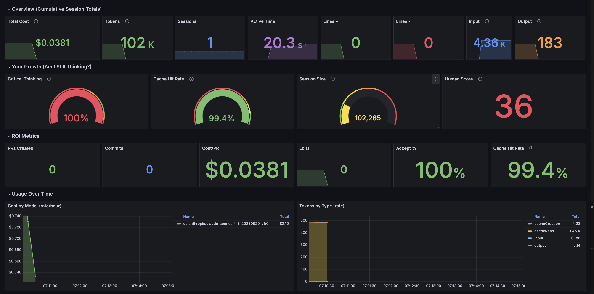

# Claude Observability Framework

A framework or general suggestions for improving human-AI collaboration via OpenTelemetry metrics.


**The goal:** Improve how you communicate, collaborate, and build together.

**Philosophy:** You are the Architect. Claude and its swarm act as your implementation partners. In early adoption, we measure communication quality, not productivity. (initially in earlly adoption). Let's prevent the nonsense factories.

```
You bring judgment, security, vision, patterns, best practices.
Claude brings speed, implementation, and patience.
The Architect decides how, what to build and when. AI helps build it right.
```

## Quick Start

```bash
# Clone
git clone https://github.com/jfr992/claude-observability-framework.git
cd claude-observability-framework

# Start stack
podman compose up -d  # or docker compose

# Configure Claude Code
export CLAUDE_CODE_ENABLE_TELEMETRY=1
export OTEL_METRICS_EXPORTER=otlp
export OTEL_LOGS_EXPORTER=otlp
export OTEL_EXPORTER_OTLP_PROTOCOL=grpc
export OTEL_EXPORTER_OTLP_ENDPOINT=http://localhost:4317

# Access dashboards
open http://localhost:3000  # Grafana (admin / claudecode)
```

Or use the interactive setup: `./scripts/setup.sh`

## Architecture

```
┌─────────────────┐     ┌──────────────────┐     ┌─────────────┐     ┌─────────────┐
│   Claude Code   │────▶│  OTEL Collector  │────▶│  Prometheus │────▶│   Grafana   │
│  (your terminal)│     │   :4317/:4318    │     │    :9090    │     │    :3000    │
└─────────────────┘     └────────┬─────────┘     └─────────────┘     └─────────────┘
                                 │
                                 ▼
                          ┌─────────────┐
                          │    Loki     │  (tool usage logs)
                          │    :3100    │
                          └─────────────┘
```

## Dashboards

### Personal Dashboard
Track your individual AI collaboration patterns:
- **Cost & Usage:** Total cost, tokens, sessions, active time
- **Efficiency Gauges:** Accept Rate, Cache Hit Rate, Session Size
- **Breakdowns:** By model, token type, terminal
- **Tool Usage:** Which Claude Code tools you use most

### Team Dashboard
Organization-wide visibility with **Developer filter** (All or specific user):
- **Overview:** Total cost, active users, PRs, commits
- **ROI Metrics:** Cost/PR, Cost/Session, Cost/Commit
- **Developer Metrics:** Per-user breakdown with Cache Hit Rate
- **Health Indicators:** Stuck developer detection (long sessions, no commits)
- **Model Usage:** Which models each developer prefers

## Key Metrics (Communication Quality)

Some metrics that matter - all about how well you communicate with Claude and how good is your setup:

| Metric | Target | What It Means |
|--------|--------|---------------|
| **Cache Hit Rate** | >90% | Your CLAUDE.md is working - Claude remembers your context |
| **Session Size** | <100k | You're being efficient - not going in circles |
| **Accept Rate** | 75-85% | You're engaged - reviewing thoughtfully, not rubber-stamping |

### Efficiency Ratios (Diagnostic Tools)

Cost/PR, Cost/Session, and Cost/Commit are included but with important framing:

| Use Case | Vanity Metric? | Learning Tool? |
|----------|----------------|----------------|
| "Juan costs $10/PR, fire him" | - Bad | — |
| "Juan's Cost/PR is high, let's check his cache hit rate and help" | — | - Good | 

** Focus on a collaborative effort to improve prompts, instructions, skills, agents, hooks, code examples, and help content—rather than scrutinizing.

**Always interpret with context:**

| Pattern | Diagnosis | Action |
|---------|-----------|--------|
| High Cost/PR + Low Cache Hit Rate | Poor CLAUDE.md | Improve project documentation |
| High Cost/PR + Large Session Size | Going in circles | Start fresh sessions more often |
| High Cost/PR + Normal metrics | Complex work | This is fine, expected for hard tasks |

The dashboards show these metrics **alongside Cache Hit Rate and Session Size** so you get the full picture.

- **Developer leaderboard for ranking** - It should create collaboration rather than competition, ask the early or senior adopters to spread the knowledge.

### What NOT to Measure

- **Commits, PRs, Lines of Code alone** - Gameable vanity metrics that incentivize wrong behavior, you can ask AI to create a script to print 1m crab emojis.
- **Cost per output without context** - Penalizes complex, thoughtful work

See [GUIDE.md](GUIDE.md) for the full Architect/Co-intelligence philosophy.

## The Architect's Role

When using AI as a co-intelligence partner, you have the ideas, you know the tools, you know how to prompt, instruct:

| You Own (Architect) | Claude Helps With |
|---------------------|-------------------|
| System design & architecture | Writing code within your constraints |
| Security principles | Implementing patterns you've defined |
| Non-functional requirements | Exploring options for you to evaluate |
| Technology selection | Generating tests you've designed |
| Code review & quality gates | Refactoring with your rules |

## Personal Dashboard Example

Use it to see how your context is improving, higher cache hit ratio means your memory files are getting better. Feel free to adjust the metrics to your needs.

 

## Available Scripts for the personal setup.

```bash
./scripts/setup.sh       # Interactive setup
./scripts/health-check.sh    # Quick metrics health check
./scripts/check-storage.sh   # Storage usage monitor
./scripts/generate-report.sh # Communication quality report
```

## Storage & Retention

| Component | Time Limit | Size Limit |
|-----------|------------|------------|
| Prometheus | 30 days | 1 GB | (adjut per your needs)
| Loki | 30 days | Ingestion throttled |
| Grafana | Unlimited | ~5 MB (config only) |

## Documentation

| Document | Purpose |
|----------|---------|
| [CLAUDE.md](CLAUDE.md) | Technical reference for Claude Code |
| [GUIDE.md](GUIDE.md) | Co-intelligence philosophy & optimization |
| [TESTING.md](TESTING.md) | Testing framework & patterns |
| [PROPOSAL-CENTRALIZED.md](PROPOSAL-CENTRALIZED.md) | Enterprise deployment proposal |

## Claude Code Skill

A skill file is included for Claude Code users:

```bash
# Install the skill
mkdir -p ~/.claude/skills/claude-observability
cp claude-observability-skill.md ~/.claude/skills/claude-observability/SKILL.md
```

This enables Claude to help with metrics interpretation and troubleshooting.

## The Philosophy

This isn't surveillance. This isn't productivity tracking, remember... CO-INTELLIGENCE!

The metrics tell you about your **communication quality** with Claude:
- Is your CLAUDE.md working? (Cache Hit Rate)
- Are you being efficient? (Session Size)
- Are you still the Architect? (Accept Rate)
- Are developers getting stuck? (Health Indicators)


NOTE: a 100% Critical Thinking accept edits doesn't mean you are doing wrong, sometimes the feedback and correction comes after the edit. The idea would be at the end to collaborate, be the expert, let the robot be your executor.


## References

- [Claude Code Monitoring Docs](https://docs.anthropic.com/en/docs/claude-code/monitoring)
- [Anthropic ROI Guide](https://github.com/anthropics/claude-code-monitoring-guide)
- [OpenTelemetry Specification](https://opentelemetry.io/docs/specs/otel/)

---

*"The best engineers don't just use AI - they collaborate with it. They bring judgment, context, and vision, expertise and pre-AI experience. AI brings speed, breadth, and tireless patience. Together, they create things neither could alone."*
